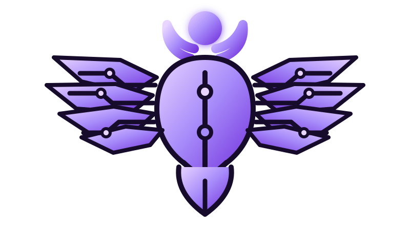

# HarnessCraft

<p align="center">
  
</p>


**Portable engineering judgment and lightweight capabilities for AI coding harnesses.**

HarnessCraft uses the **Scarab Circuit** identity: a modern Egyptian-inspired scarab fused with circuit geometry. The terminal version deliberately preserves that original scarab rather than replacing it with a generic monogram. See [`docs/brand/`](docs/brand/).

HarnessCraft carries a consistent engineering operating model across Codex, Claude Code, Cursor, OpenCode, Pi, and other Agent Skills-compatible harnesses. Skills contain the judgment. Harness-specific adapters add only the capabilities a harness is missing.

## Why

Coding agents are increasingly capable, but the quality of their work still depends on the engineering rules, decision boundaries, verification habits, and tools around them. Maintaining a different prompt stack for every harness creates drift.

HarnessCraft keeps one canonical source of engineering behavior:

- understand the system before changing it;
- separate business facts from technical assumptions;
- prefer explicit boundaries over speculative abstraction;
- use deterministic code for deterministic rules;
- treat LLMs as bounded reasoning components, not authorities;
- characterize risky behavior before refactoring it;
- make small, reviewable changes;
- verify focused behavior first, then the complete quality gate;
- review architecture and maintainability, not only passing tests;
- require explicit human approval for consequential operations.

## Repository shape

```text
skills/                 canonical Agent Skills
extensions/pi/          Pi-only executable capability shims
profiles/               recommended context/tool exposure profiles
docs/                   architecture and design notes
scripts/                 installer, doctor, and validation CLI
tests/                   repository contract tests
```

The skills are intentionally usable without the Pi extensions. A skill may recommend a capability, but it must degrade to native harness tools rather than require a HarnessCraft-specific executable tool.

## Skills in v0.1

- `harnesscraft-engineering-core`
- `harnesscraft-architecture`
- `harnesscraft-safe-delivery`
- `harnesscraft-code-review`
- `harnesscraft-ai-engineering`

## Pi capabilities in v0.1

Pi stays intentionally small. HarnessCraft currently adds only:

- `hc_repo_context` — compact structured repository state in one tool call.
- `hc_search_web` — provider-neutral web search using Brave, Tavily, or SearXNG.
- safety gates — human confirmation before destructive or consequential shell operations.

## Install

### From a checkout today

Until the first npm release is published, clone the repository and run the installer directly:

```bash
node ./scripts/harnesscraft.mjs install --harness agents --profile balanced
```

The portable default is the open `.agents/skills` convention. Harness-specific targets are also supported:

```bash
node ./scripts/harnesscraft.mjs install --harness codex --profile balanced
node ./scripts/harnesscraft.mjs install --harness claude --profile balanced
node ./scripts/harnesscraft.mjs install --harness cursor --profile balanced
node ./scripts/harnesscraft.mjs install --harness opencode --profile balanced
```

Use `--scope project` to install into the current repository instead of your user-level configuration.

After npm publication, the same CLI will be available as:

```bash
npx @hazemyoussif/harnesscraft install --harness agents --profile balanced
```

For skills-only installation through the wider Agent Skills ecosystem, the public GitHub repository can also be installed with:

```bash
npx skills add hazemyoussif/harnesscraft -g
```

Use the HarnessCraft CLI instead when you want profile reconciliation or Pi-native tools.

### Pi

Pi can install the whole package directly from GitHub:

```bash
pi install git:github.com/hazemyoussif/harnesscraft
```

For a local checkout:

```bash
pi install /path/to/harnesscraft
```

This installs the same canonical skills plus Pi-native extensions.

## Profiles

Profiles do not change the principles. They change how much context and how many capabilities are exposed.

| Profile | Intended use |
|---|---|
| `minimal` | Tiny context surface; small/local models; simple tasks |
| `local` | Local coding models; architecture discipline with few tools |
| `balanced` | Default for most coding work |
| `frontier` | Strong frontier models doing broad architecture/AI work |

Inspect them with:

```bash
harnesscraft list
```

## Web search configuration for Pi

`hc_search_web` chooses the first configured provider unless `provider` is explicitly supplied.

### Brave

```bash
export BRAVE_SEARCH_API_KEY=...
```

### Tavily

```bash
export TAVILY_API_KEY=...
```

### SearXNG

```bash
export SEARXNG_URL=https://your-searxng.example
```

No API secrets are stored by HarnessCraft.

## Safety model

Skills express judgment; executable adapters enforce only narrow invariants. HarnessCraft does **not** try to make an agent "safe" through a giant blacklist.

The Pi safety gate asks for explicit approval before recognized consequential operations such as force-push, hard reset, destructive cleanup, merge/rebase, database destruction, infrastructure destruction, or package publishing.

The gate is defense-in-depth, not a security sandbox.

## Design rules

1. Canonical behavior belongs in `skills/`, not duplicated per harness.
2. Harness adapters stay thin.
3. Skills must remain useful without HarnessCraft executable tools.
4. Avoid exposing tools that the harness already provides well.
5. Prefer progressive disclosure over permanent prompt inflation.
6. Local-model profiles should minimize tool and context surface.
7. No installer silently overwrites a modified skill.
8. Installation state is explicit and reversible.

See [`docs/architecture.md`](docs/architecture.md).

## Terminal identity

```text
              .-=-.
             /  o  \
          .-(  ___  )-.
      _.-'  '-( o )-'  '-._
  _.-'==o=====\ | /=====o=='-._
<===-----------o|o-----------===>
  '-._==o=====/ | \=====o==_.-'
      '-._     | |     _.-'
          \    |o|    /
           \   | |   /
            \__|_|__/
```

The CLI keeps this text-native Scarab Circuit mark for terminal surfaces.

## Development

```bash
npm run check
node ./scripts/harnesscraft.mjs doctor
```

## Status

`0.1.0` is the foundation release. The priority is to stabilize the engineering skills and Pi adapter before adding more harness-specific code.
