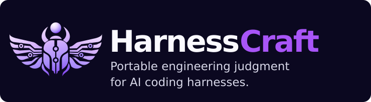

# HarnessCraft

<p align="center">
  
</p>

<p align="center">
  <strong>Portable engineering judgment for AI coding harnesses.</strong>
</p>

<p align="center">
  Reusable Agent Skills for architecture, delivery, review, and AI engineering — with lightweight harness-specific capabilities where they add real value.
</p>

---

## Install

Install HarnessCraft through the Agent Skills ecosystem:

```bash
npx skills add hazemyoussif/harnesscraft
```

HarnessCraft is designed to work across Agent Skills-compatible coding harnesses, including **Codex, Claude Code, Cursor, OpenCode, Pi**, and others.

For Pi, which can also consume HarnessCraft's native extensions:

```bash
pi install git:github.com/hazemyoussif/harnesscraft
```

The skills remain the canonical product. Harness-specific extensions are optional compatibility layers, not duplicated prompt stacks.

## What HarnessCraft is

Coding agents are increasingly capable, but capable models do not automatically produce disciplined engineering.

The surrounding operating model still matters:

- how assumptions are identified;
- where business rules live;
- when an abstraction is justified;
- how risky behavior is characterized before refactoring;
- how architecture is reviewed beyond a green test suite;
- where an LLM is allowed to reason and where deterministic code must remain authoritative;
- when a consequential action requires explicit human approval.

HarnessCraft packages those decisions as portable Agent Skills so the same engineering mindset can travel across coding harnesses without maintaining a different ruleset for each one.

> **Skills contain the judgment. Tools supply only missing capabilities.**

## Core skills

| Skill | Purpose |
|---|---|
| `harnesscraft-engineering-core` | Default engineering operating model: understand before changing, separate facts from assumptions, make small coherent changes, and finish with evidence. |
| `harnesscraft-architecture` | Architecture boundaries, ownership, integration design, modularity, adapters, and evidence-based abstraction. |
| `harnesscraft-safe-delivery` | Controlled implementation and release workflow with characterization, focused verification, full quality gates, and explicit approval for consequential operations. |
| `harnesscraft-code-review` | Review for correctness, regressions, security, architecture ownership, failure behavior, maintainability, and test quality. |
| `harnesscraft-ai-engineering` | Production LLM/agent engineering with bounded model responsibility, structured contracts, provider neutrality, deterministic validation, and evaluation. |

## Engineering principles

HarnessCraft deliberately favors a small number of strong rules over a large collection of generic prompts.

Its default stance is to:

1. **Understand before changing.** Read the relevant code, tests, contracts, documentation, configuration, and recent change context first.
2. **Separate facts from assumptions.** Distinguish known system behavior, business requirements, and implementation hypotheses.
3. **Prefer explicit ownership.** Keep domain rules, application behavior, adapters, persistence, transport, and UI responsibilities clear.
4. **Abstract from evidence.** Introduce abstractions for real variation points or ownership boundaries, not imagined future complexity.
5. **Keep deterministic rules deterministic.** LLMs are bounded reasoning components, not authorities for security, tenancy, accounting invariants, or destructive actions.
6. **Characterize before risky refactors.** Protect relied-upon behavior before restructuring it.
7. **Make small, reviewable changes.** Optimize for understandable diffs and recoverable delivery.
8. **Verify behavior, not ceremony.** Passing tests are evidence, not proof that architecture, authorization, or failure handling is correct.
9. **Require explicit approval for consequential operations.** Merge, force-push, destructive cleanup, production changes, publishing, and similar actions remain human decisions.

## Skills-first architecture

```text
skills/                 canonical Agent Skills
profiles/               recommended context/tool exposure profiles
extensions/pi/          optional Pi-native capability shims
scripts/                installer, doctor, and validation CLI
docs/                   architecture, roadmap, and brand guidance
tests/                  repository contract tests
```

HarnessCraft avoids maintaining separate versions of the same engineering rules for every agent.

A portable skill should remain useful with the harness's native tools. Harness-specific code is introduced only when it supplies a capability the harness genuinely lacks or removes repeated tool overhead.

See [`docs/architecture.md`](docs/architecture.md) for the design model.

## Profiles

Profiles change **how much context and tooling is exposed**, not the underlying engineering principles.

| Profile | Best for |
|---|---|
| `minimal` | Small context windows, constrained/local models, straightforward tasks |
| `local` | Local coding models that benefit from strong discipline with a small tool surface |
| `balanced` | General day-to-day engineering work |
| `frontier` | Strong frontier models doing broad architecture or AI engineering work |

The profiles are intentionally progressive. Smaller models receive less permanent context and fewer advertised tools before the engineering rules themselves are weakened.

## Pi extensions

Pi is intentionally minimal, so HarnessCraft currently adds only a few targeted capabilities:

### `hc_repo_context`

Returns compact structured repository context in a single call, including branch, HEAD, working-tree state, upstream status, recent commits, package manager, and guidance files.

This reduces repetitive shell/tool loops before substantial repository work.

### `hc_search_web`

Provider-neutral public web search using a configured **Brave**, **Tavily**, or **SearXNG** provider.

Configure one of:

```bash
export BRAVE_SEARCH_API_KEY=...
```

```bash
export TAVILY_API_KEY=...
```

```bash
export SEARXNG_URL=https://your-searxng.example
```

HarnessCraft does not store these secrets.

### Safety gates

The Pi adapter requests explicit confirmation before recognized consequential shell operations such as:

- force-push or destructive Git history changes;
- hard reset or destructive cleanup;
- merge or rebase;
- destructive database operations;
- infrastructure destruction;
- package publishing.

These gates are defense-in-depth, not a security sandbox.

## Brand identity

HarnessCraft uses the **Scarab Circuit** identity: a modern Egyptian-inspired scarab fused with circuit geometry.

The identity reflects the project's core idea: established engineering judgment carried into modern AI-assisted development.

The Egyptian influence is intentionally structural rather than ornamental — expressed through symmetry, the scarab silhouette, wing geometry, and the solar orb.

Brand assets and usage guidance live in [`docs/brand/`](docs/brand/).

## Repository development

Requirements:

- Node.js **22.19+**

Run the repository checks with:

```bash
npm run check
```

Run the installation/environment doctor with:

```bash
node ./scripts/harnesscraft.mjs doctor
```

## Contributing

HarnessCraft is intentionally opinionated and intentionally small.

A new skill should encode a broadly reusable engineering decision boundary that is meaningfully distinct from the existing skills.

A new tool should either:

- provide a capability the target harness does not have; or
- measurably remove repetitive, expensive agent/tool loops.

Please read [`CONTRIBUTING.md`](CONTRIBUTING.md) before proposing changes.

## Status

HarnessCraft is currently at **v0.1.0**.

The immediate priority is to stabilize the core engineering skills, validate them across different model classes and harnesses, and keep the executable surface small before expanding into additional integrations.

## License

[MIT](LICENSE)
